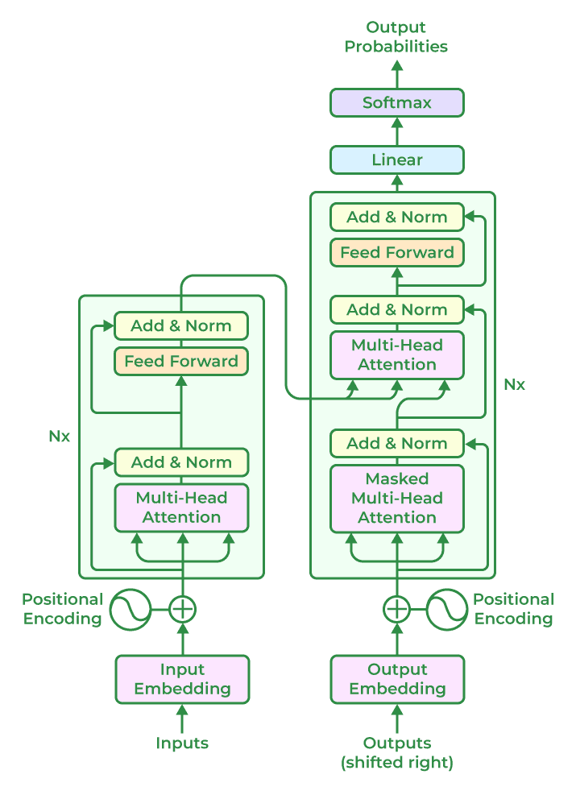

# Transformer-Based LLM Model Architectures

1. **Input Embeddings**: The input text is **tokenized into smaller units**, such as words or sub-words, and **each token is embedded into a continuous vector representation**. This embedding step **captures the semantic and syntactic information** of the input.
2. **Positional Encoding**: Positional encoding is added to the input embeddings to **provide information about the positions of the tokens** because transformers do not naturally encode the order of the tokens. This enables the model to **process the tokens while taking their sequential order into account**.
3. Encoder: Based on a neural network technique, the encoder **analyses the input text and creates a number of hidden states that protect the context and meaning of text data**. **Multiple encoder layers** make up the core of the transformer architecture. **Self-attention mechanism and feed-forward neural network** are the two fundamental sub-components of each encoder layer.
    a. **Self-Attention Mechanism**: Self-attention enables the model to **weigh the importance of different tokens in the input sequence by computing attention scores**. It allows the model to **consider the dependencies and relationships between different tokens in a context-aware manner**.
    b. **Feed-Forward Neural Network**: After the self-attention step, a feed-forward neural network is **applied to each token independently**. This network includes **fully connected layers with non-linear activation functions**, allowing the model to **capture complex interactions between tokens**.
4. **Decoder Layers**: In some transformer-based models, a decoder component is included in addition to the encoder. The decoder layers **enable autoregressive generation, where the model can generate sequential outputs by attending to the previously generated tokens**.
5. **Multi-Head Attention**: Transformers often employ multi-head attention, where self-attention is performed simultaneously with different learned attention weights. This allows the model to **capture different types of relationships and attend to various parts of the input sequence simultaneously**.
7. **Layer Normalization**: Layer normalization is **applied after each sub-component or layer** in the transformer architecture. It helps **stabilize the learning process and improves the model’s ability to generalize across different inputs**.
7. **Output Layers**: The output layers of the transformer model can **vary depending on the specific task**. For example, in language modeling, **a linear projection followed by SoftMax activation is commonly used to generate the probability distribution over the next token**.
