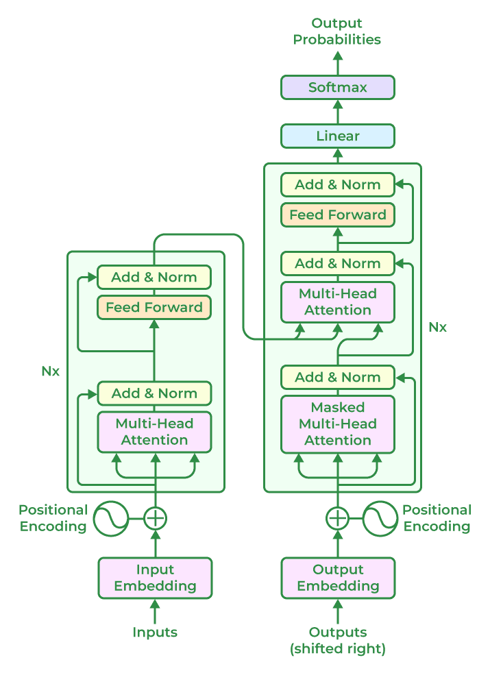

# Transformer

## Transformer-Based LLM Model Architectures

1. **Input Embeddings**: The input text is **tokenized into smaller units**, such as words or sub-words, and **each token is embedded into a continuous vector representation**. This embedding step **captures the semantic and syntactic information** of the input.
2. **Positional Encoding**: Positional encoding is added to the input embeddings to **provide information about the positions of the tokens** because transformers do not naturally encode the order of the tokens. This enables the model to **process the tokens while taking their sequential order into account**.
3. **Encoder**: Based on a neural network technique, the encoder **analyses the input text and creates a number of hidden states that protect the context and meaning of text data**. **Multiple encoder layers** make up the core of the transformer architecture. **Self-attention mechanism and feed-forward neural network** are the two fundamental sub-components of each encoder layer.
   a. **Self-Attention Mechanism**: Self-attention enables the model to **weigh the importance of different tokens in the input sequence by computing attention scores**. It allows the model to **consider the dependencies and relationships between different tokens in a context-aware manner**.
   b. **Feed-Forward Neural Network**: After the self-attention step, a feed-forward neural network is **applied to each token independently**. This network includes **fully connected layers with non-linear activation functions**, allowing the model to **capture complex interactions between tokens**.
4. **Decoder Layers**: In some transformer-based models, a decoder component is included in addition to the encoder. The decoder layers **enable autoregressive generation, where the model can generate sequential outputs by attending to the previously generated tokens**.
5. **Multi-Head Attention**: Transformers often employ multi-head attention, where self-attention is performed simultaneously with different learned attention weights. This allows the model to **capture different types of relationships and attend to various parts of the input sequence simultaneously**.
6. **Layer Normalization**: Layer normalization is **applied after each sub-component or layer** in the transformer architecture. It helps **stabilize the learning process and improves the model’s ability to generalize across different inputs**.
7. **Output Layers**: The output layers of the transformer model can **vary depending on the specific task**. For example, in language modeling, **a linear projection followed by SoftMax activation is commonly used to generate the probability distribution over the next token**.

## Superpostion

This concept is **profoundly significant for large language models (LLMs)** and neural networks in general, as it directly relates to their ability to efficiently represent and disentangle **vast numbers of features** (e.g., words, syntax, semantics, context) in high-dimensional spaces. Here's a breakdown of why near-orthogonality is critical:

### 1. **The Geometry of High-Dimensional Spaces**

- **Orthogonality in Low vs. High Dimensions**:

  - In an \( n \)-dimensional space, **strict orthogonality** (90° angles between vectors) limits you to \( n \) mutually perpendicular vectors.
  - However, in **high-dimensional spaces** (e.g., 512D, 1024D, or 4096D embeddings used in LLMs), vectors can be *nearly orthogonal* while still being densely packed. For example:
    - In 1000D space, you can fit **millions of vectors** with pairwise angles between 89° and 91°.
    - This arises from the **"blessing of dimensionality"**: as dimensions grow, random vectors tend to approximate orthogonality naturally.
- **Why This Matters**:
  LLMs must represent **far more features** (e.g., words, phrases, concepts) than the dimensionality of their embeddings. Near-orthogonality allows them to:

  - Compress exponentially more features into a fixed-dimensional space.
  - Avoid catastrophic interference between features while retaining separability.

---

### 2. **Superposition: Representing More Features Than Dimensions**

- **Principle of Superposition**:
  Neural networks, including Transformers, use **linear combinations** of nearly orthogonal vectors to encode overlapping features in shared dimensions. For example:

  - The embedding for the word "bank" might combine vectors for "finance," "river," and "slope" in superposition.
  - A single neuron or attention head can detect multiple distinct patterns by leveraging near-orthogonal components.
- **Efficiency**:
  If features were strictly orthogonal, an LLM with \( n \)-dimensional embeddings could only represent \( n \) independent concepts. With near-orthogonality, it can represent **exponentially more** (e.g., \( O(2^n) \)) features by exploiting the geometry of high-dimensional spaces.

---

### 3. **Disentangling Features via Linear Algebra**

- **Nearly Orthogonal = Linearly Separable**:
  Even if feature vectors are not perfectly orthogonal, small angles (e.g., 89°–91°) ensure they are **linearly separable**. This allows LLMs to:

  - Distinguish subtle semantic differences (e.g., "happy" vs. "joyful").
  - Isolate syntactic roles (e.g., subject vs. object).
  - Recover individual features from their superpositions using simple linear operations (e.g., dot products, attention mechanisms).
- **Example**:
  If the vectors for "king" and "queen" are nearly orthogonal to "gender" and "royalty" axes, the model can manipulate them algebraically (e.g., `king - man + woman ≈ queen`).

---

### 4. **Robustness to Noise and Sparsity**

- **Noise Tolerance**:
  Near-orthogonal representations are **robust to perturbations**. Small overlaps between vectors do not destroy the model’s ability to distinguish features, unlike in low-dimensional spaces.
- **Sparse Activation**:
  LLMs use sparse activation patterns (e.g., in mixture-of-experts layers), where only a subset of neurons fire for a given input. Near-orthogonality ensures these activations minimally interfere with one another.

---

### 5. **Practical Implications for LLMs**

- **Scalability**:
  Near-orthogonality allows LLMs to scale to **massive vocabularies** (e.g., 50k+ tokens) and complex linguistic patterns without requiring infeasibly large embedding dimensions.
- **Contextual Flexibility**:
  Words with multiple meanings (polysemy) can be represented as superpositions of near-orthogonal vectors (e.g., "bank" = finance + river), with context determining which component dominates.
- **Efficient Attention**:
  In Transformers, keys and queries in self-attention rely on near-orthogonality to focus on relevant tokens while ignoring irrelevant ones. For example:
  - If query and key vectors are nearly orthogonal, their dot product (attention score) is near zero, suppressing attention.

---

### 6. **Theoretical Limits and Tradeoffs**

- **Johnson-Lindenstrauss Lemma**:
  This mathematical result guarantees that high-dimensional embeddings can preserve pairwise distances between features, even with near-orthogonality.
- **Interference vs. Capacity**:
  As angles between vectors shrink (e.g., from 90° to 80°), interference increases, but capacity (number of storable features) grows. LLMs strike a balance suited to natural language’s structure.

---

### **Why This Matters for LLMs**

- **Efficiency**: Enables compact representation of exponentially many features.
- **Expressivity**: Supports rich, context-dependent semantics.
- **Generalization**: Allows models to handle rare or unseen words by composing near-orthogonal vectors.
- **Interpretability**: Nearly orthogonal features align with human intuitions about discrete concepts (e.g., "science" vs. "art").

---

### **Conclusion**

Near-orthogonality in high-dimensional spaces is a **fundamental enabler of modern LLMs**. It allows these models to:

1. Pack vast numbers of features into manageable dimensions.
2. Maintain separability for precise semantic/syntactic distinctions.
3. Scale efficiently to handle the complexity of human language.

This geometric property is why LLMs can achieve remarkable performance despite finite computational resources—**they exploit the "curse of dimensionality" as a blessing**.
